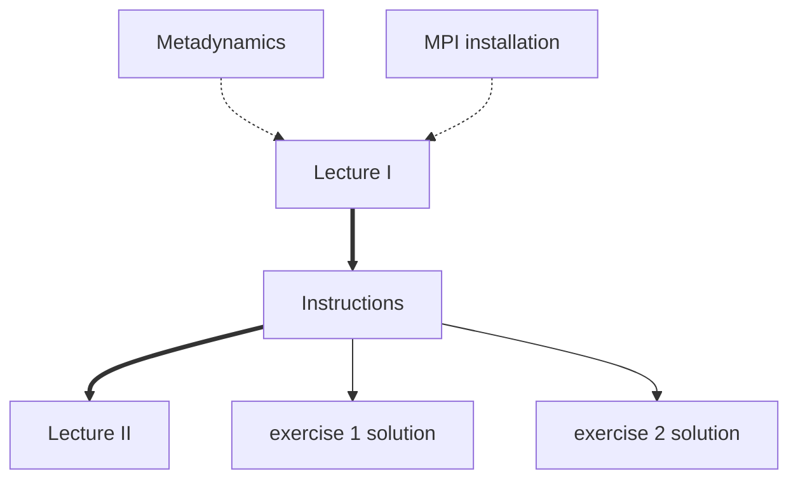

#  PLUMED Masterclass 21.7: Optimizing PLUMED performances

This lesson was given as part of the PLUMED masterclass series in 2021.  It includes:

* A video that explain the theory covered and a second video which shows you how the exercises should be completed.
* A series of exercises that you should try to complete yourself.
* Some supplementary python notebooks that provide further background information on the exercise.

The flow chart shown below indicates the order in which you should consult the resources.  You can click on the nodes to access the various resources.  Follow the thick black lines for the best results.  The resources that are connected by dashed lines are supplmentary resources that you may find useful when completing the exercise. 

This lesson was the seventh masterclass in the 2021 series.  You will likely be able to complete the exercise without completing all the exercises in the first six masterclasses in the series.  However, you will need to install plumed and gromacs so that you can run in MPI (installing PLUMED and gromacs is covered in the 5th masterclass).  You will also be working on optimising performance in metadyanmics simulations. This method was introduced in the fourth masterclass in the series.

